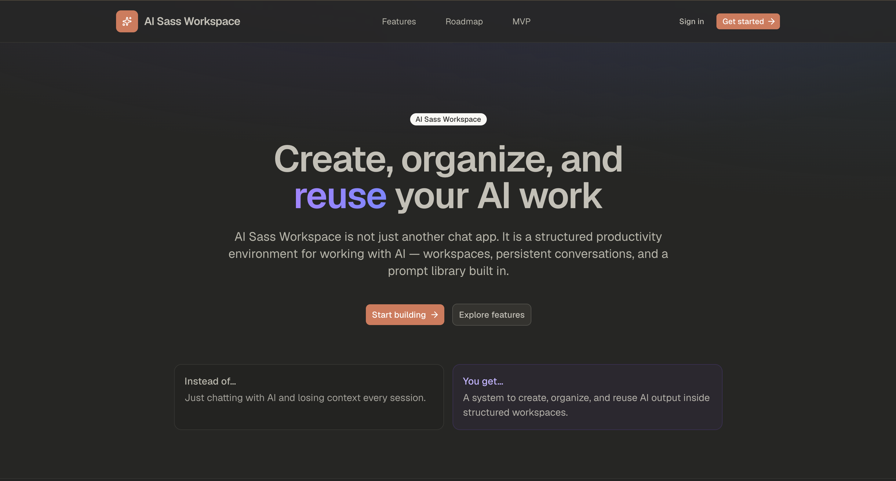

<p align="center">
  
</p>

# AI Saas Workspace

A full-stack AI SaaS starter built for real product workflows — not a toy chatbot demo.

Users get workspaces to separate contexts, streaming AI conversations that persist, a reusable prompt library, profile settings, and Stripe-powered plans with message credits. If you landed here from the YouTube course, this is the repository you clone and build along with.

**Live demo:** [ai-sass-workspace.vercel.app](https://ai-sass-workspace.vercel.app)

---

## What you get

This project walks through a complete SaaS vertical slice:

- Email + Google authentication with protected routes
- Multi-workspace organization
- Streaming chat with markdown and syntax-highlighted code blocks
- Message history saved per chat
- Prompt library with categories, favorites, and insert-into-chat
- Profile updates and avatar uploads
- Stripe checkout, plan upgrades, and credit limits
- Unit tests around core business logic

The goal is simple: ship something that feels like a real product, built in the right order.

---

## Tech stack

| Layer | Choice |
| --- | --- |
| App | Next.js 16 (App Router), TypeScript, React 19 |
| UI | Tailwind CSS, shadcn/ui |
| Auth & storage | Supabase Auth, Supabase Storage |
| Database | PostgreSQL + Drizzle ORM |
| Payments | Stripe |
| AI | Groq (`llama-3.1-8b-instant`) |
| Testing | Jest, Testing Library, jsdom |
| Deploy | Vercel |

---

## Getting started

### Prerequisites

- Node.js 20+
- A Supabase project
- A Stripe account (test mode is fine)
- A Groq API key

### Install

```bash
git clone https://github.com/<your-username>/saas-workspace.git
cd saas-workspace
npm install
```

### Environment

```bash
cp .env.example .env
```

Fill in:

```env
NEXT_PUBLIC_SUPABASE_URL=
NEXT_PUBLIC_SUPABASE_PUBLISHABLE_KEY=
SUPABASE_SERVICE_ROLE_KEY=
DATABASE_URL=

NEXT_PUBLIC_PUBLISHABLE_STRIPE_KEY=
STRIPE_SECRET_KEY=

GROQ_API_KEY=

NEXT_PUBLIC_APP_URL=http://localhost:3000
```

`NEXT_PUBLIC_APP_URL` should match the URL you are running on. Locally that is `http://localhost:3000`. In production, set it to your Vercel domain **without** a trailing slash.

Also configure Supabase Auth:

- **Site URL** → your app URL
- **Redirect URLs** → `http://localhost:3000/auth/callback` (and your production callback URL when deployed)

### Database

Push the Drizzle schema to your Postgres database:

```bash
npm run db:push
```

### Run the app

```bash
npm run dev
```

Open [http://localhost:3000](http://localhost:3000).

---

## Testing

This repo includes automated tests for the pieces that are easy to break and expensive to debug by hand: validation schemas, Stripe helpers, plan mapping, credits logic, and shared constants.

Stack:

- **Jest** as the test runner
- **Testing Library** for DOM-related setup
- **jsdom** as the test environment
- **next/jest** so Next.js path aliases and transforms work out of the box

Useful commands:

```bash
npm run test              # run the full suite once
npm run test:watch        # re-run on file changes
npm run test:coverage     # coverage report
```

Tests live next to the code they cover, for example:

```text
src/lib/validation/auth.test.ts
src/lib/validation/profile.test.ts
src/lib/stripe/plans.test.ts
src/lib/stripe/utils.test.ts
src/lib/subscription/credits.test.ts
src/constants/index.test.ts
```

When you follow the course, treat tests as part of the feature — not an optional afterthought. If you change billing, credits, or validation rules, run the suite before moving on.

---

## Project structure

```text
src/
  app/                  # routes, pages, API handlers
    (dashboard)/        # authenticated product UI
    (landing)/          # marketing site
    api/chat/           # streaming chat endpoint
    auth/               # login, signup, callback, password flows
  components/           # shared UI + dashboard components
  lib/
    actions/            # server actions
    db/                 # Drizzle client + schema
    stripe/             # Stripe client, plans, sync helpers
    subscription/       # credit consumption logic
    supabase/           # browser + server clients
    validation/         # Zod schemas
  constants/            # app-wide constants
```

---

## Scripts

```bash
npm run dev           # development server
npm run build         # production build
npm run start         # serve production build
npm run lint          # ESLint
npm run test          # Jest
npm run test:watch    # Jest watch mode
npm run test:coverage # Jest coverage
npm run db:generate   # generate Drizzle migrations
npm run db:push       # push schema to the database
```

---

## Deploying to Vercel

1. Push the repo to GitHub and import it in Vercel.
2. Add the same environment variables from `.env.example`.
3. Set `NEXT_PUBLIC_APP_URL` to your production URL.
4. Update Supabase Site URL + Redirect URLs to the Vercel domain.
5. Deploy.

---

## Course note

This repository is the companion codebase for the YouTube build. Clone it, set up your own keys, and follow each lesson against this project. Keep your `.env` private — never commit secrets.

If something breaks after a lesson, start with:

1. Environment variables
2. Supabase redirect URLs
3. `npm run db:push`
4. `npm run test`
